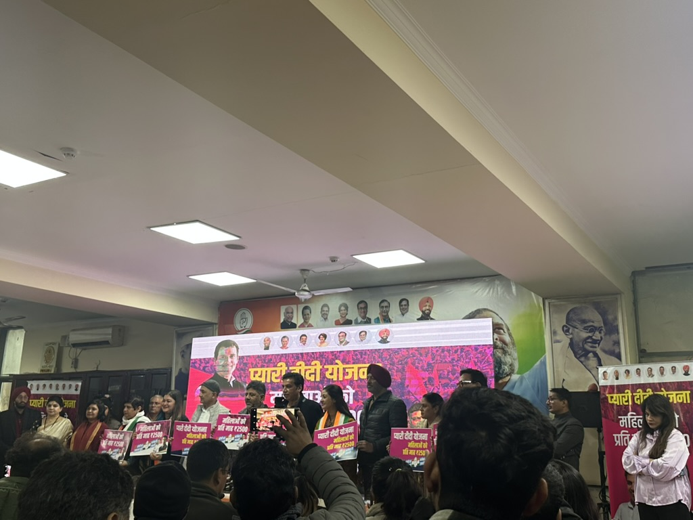

# Dissertation Project

{width="6in"}

**2025 Delhi Election Press Conference**

India’s urban political landscape presents a paradox. The Women’s Reservation Act (2023) mandates 33% of seats in state and national assemblies be reserved for women. Set to be implemented within the next decade, it expands reservations beyond local governance. Yet, women remain underrepresented among political parties - a key pipeline to elected office - as workers, leaders, and electoral candidates. This dissonance raises a challenge: Once reservations take effect, where will parties find women candidates with real political power, not just proxies for male family members, as seen in rural politics since reservations began in 1993?

Focusing on political parties as the primary pipeline to electoral representation, my dissertation addresses this paradox by investigating two questions: (1) Where are gender gaps most pronounced in the urban political party hierarchy, and why? (2) How can these gaps be bridged to facilitate women’s upward mobility in political parties and elected positions? I situate my research in Delhi, India’s capital city with a population of approximately 30 million. I use qualitative theory-building and survey and field experiments to examine how political parties act as gatekeepers to women's representation and upward mobility within parties and as electoral candidates and strategies to circumvent political party gatekeeping.
